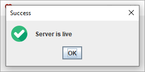
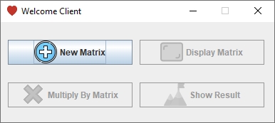
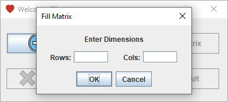
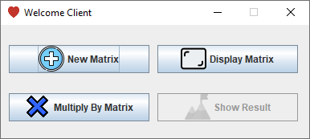
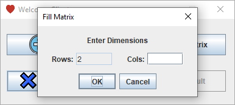
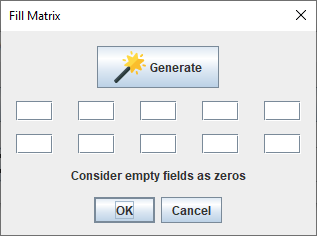
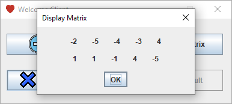
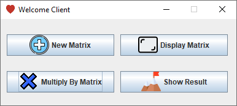
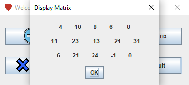

<p align="center">

      _____                       _                        _
     |  __ \                     | |                      | |
     | |__) |   ___    __ _    __| |    _ __ ___     ___  | |
     |  _  /   / _ \  / _` |  / _` |   | '_ ` _ \   / _ \ | |
     | | \ \  |  __/ | (_| | | (_| |   | | | | | | |  __/ |_|
     |_|  \_\  \___|  \__,_|  \__,_|   |_| |_| |_|  \___| (_)

</p>

---

<p align = "center">💡 Project Documentation</p>

## Table of Contents

- [Brief description about Java RMI](#why_java)
- [Project Description](#project_description)
- [Project Setup](#project_requirement)
- [Policy File](#policy_file)
- [Project Overview](#project_overview)

## Why we use Java RMI? <a name = "why_java"></a>

- The purpose of RMI is to allow the calling, execution and return of the result of a method executed in a virtual machine different from that of the calling object. This virtual machine can be on a different machine provided that it is accessible by the network.

- The machine on which the remote method runs is called the server.

- Calling such a method on the client side is a little more complicated than calling a method of a local object, but it is still simple. It consists of obtaining a reference to the remote object and then simply calling the method from this reference.

- RMI technology is responsible for making transparent the location of the remote object, its call and the return of the result.

- In fact, it uses two particular classes, the stub and the skeleton, which must be generated with the rmic tool provided with the JDK.

- The stub is a client-side class and the skeleton is its server-side counterpart. These two classes are responsible for providing all the mechanisms for calling, communicating, executing, returning and receiving the result.

## Project Description <a name = "project_description"></a>

The purpose of this project is to develop Java code for a client and a server that will use the RMI so that they can communicate with each other.

The client will enter two matrices to be multiplied. It will then ask the server to create RMI objects each of which will take care of part of the computation of the matrix product within the server and return the result to the client.

In developing the solution, we choose the following constraints in the implementation :

- The creation of RMI objects must be done via object factories.
- The use of threads to perform parallelized matrix computation;
- The use of rich graphical interface (Swing)

## Project Setup <a name = "project_setup"></a>

• Compiling the source code file

```
javac *.java
```

• Generating the stub and skeleton using the rmi compiler

```
rmic FabriqueImpl
```

• Copie All java files and java classes to another folder (Files Folder) except (Server.class, Server.java) in Server Folder.

• Copie All java files and java classes to another folder (Files Folder) except (DynamicClient.class, DynamicClient.java) in Client Folder.

-- Running Server

- Inside Server Folder run :

```
java -Djava.server.rmi.codebase=file:/(absolute_path_to_files_folder)/
-Djava.security.policy=server.policy Server
```

-- Running Client

- Inside Client Folder run :

```
java -Djava.server.rmi.codebase=file:/(absolute_path_to_files_folder)/
-Djava.security.policy=client.policy DynamicClient
```

## Why is Policy file needed ? <a name = "policy_file"></a>

Policy file needed by the client(filename:client.policy)

- The default Java security policy does not allow all the network
  operations needed to dynamically load remote classes (e.g. dynamically
  load the stub required by the client). This policy grants the network
  permissions needed.

- It gives the RMI object server machine (in this case osprey.unf.edu)
  permission to open connections to the local machine
  (i.e. to the client machine).

Policy file needed by the server(filename:server.policy)
The default Java security policy does not allow all the network operations needed to dynamically load remote classes.

- This policy grants the network permissions needed. It gives any client machines permission to open connections to the RMI Server machine using port numbers 1024-65535.

- This would be necessary if the client were to dynamically load classes
  to the server, hence invoking the RMISecurityManager. If the client is
  not going to load classes to the RMI server, then the RMI server need
  not implement the RMISecurityManager. In that case, this security
  policy file is not needed.

## Project Overview <a name = "project_overview"></a>

**Server Side:**




**Client Side:**



















## P.S. <a name = "ps"></a>

- This repo is under active development. If you have any improvements / suggestions please file an [issue](https://github.com/sadekmehri/Java-RMI/issues/new).

- The [issues](https://github.com/sadekmehri/Java-RMI/issues) page is a good place to visit if you want to pick up some task. It has a list of things that are to be implemented in the near future

<p xmlns:dct="http://purl.org/dc/terms/" xmlns:vcard="http://www.w3.org/2001/vcard-rdf/3.0#">
  <a rel="license"
     href="http://creativecommons.org/publicdomain/zero/1.0/">
    
  </a>
  <br />
  To the extent possible under law,
  <a rel="dct:publisher"
     href="https://github.com/kylelobo/">
    <span property="dct:title">Sadok Mehri</span></a>
  has waived all copyright and related or neighboring rights to this project.
</p>
